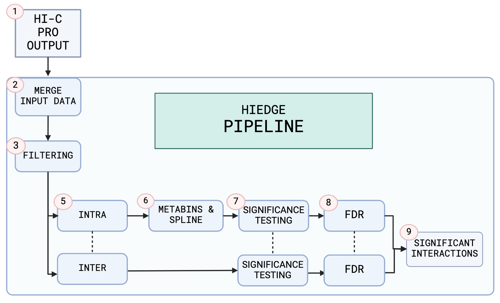

# HiEdge

## Overview

HiEdge is a Hi-C pipeline used to easily and automatically process output data from Hi-C Pro to significant interactions. All you need to do it provide the input directory containing the Hi-C data, and the pipeline does the rest.

Supported input formats are the HiC-Pro output files (.BED, .matrix, .matrix.balanced & .bias).
The pipeline matches files from the same resolution and experiment and aggregates them to one datastructure.
This allows for easy processing of multiple resolutions and experiments in parallel - and per-dataset filtering options - including processing of inter- and intrachromosomal interactions in the same run.
These filtering options include chromosomes, specific genomic regions, blacklisted regions and ceontromeres.
This means that you can easily filter out unwanted data and only keep the significant interactions on a per-dataset and per-resolution basis.
Each filtering option can be customized or turned entirely off - allowing for modular and flexible processing of the data.

After filtering the data, singificance testing is done - which is handled separately for inter- and intrachromosomal interactions due to the differences in background noise and expected interactions.
For intrachromosomal data the bins are aggregated to "metabins" and these metabins are then used to generate a monotonically decreasing spline fit to the genomic distance over interaction frequency.
This spline is then used to generate a null model for the data, which is used to calculate the p-values using a binomial survival test, before doing FDR correction.
For interchromosomal data there is no distance-dependant decay, instead the interaction frequencies are used directly in the survival test before FDR correction.
The end result is a list of significant interactions, with p-values and adjusted p-values, that can be used for further analysis.
The output format can be specified as needed.

All settings are specified in a configuration file, which allows for easy customization of the pipeline.
One run of the pipeline can contain multiple datasets, and each dataset can contain multiple resolutions and experiments - but one run of the pipeline corresponds to one configuration file.



## Installation

1. Clone the repository

```bash
git clone https://github.com/Gabrielstav/HiEdge.git
cd HiEdge
```

2. Set up a virtual environment

```bash
python -m venv venv
source venv/bin/activate  # On Windows use: venv\Scripts\activate
```

3. Install dependencies

```bash
pip install -r requirements.txt
```

## Running the pipeline

To run the pipeline, simply run the main.py script with the path to the configuration file as an argument (--config, -c flag).
If needed you can also name the run with the (--run_name, -r flag), if no name is given the run directory will be named after the current timestamp.

```bash
python main.py -c path/to/config_file.yaml -r run_name
```

## Configuration

The configuration file is a YAML file that specifies the settings for the pipeline.

### Paths

- input_dir: Directory containing HiC-Pro output files
- run_dir: Output directory containing HiEdge results
- output_dir: Not used
- temp_dir: Not used

### Reference data

- blacklist_dir: Directory containing blacklisted regions (must be in ENCODE BED format and correspond to the genome version used in the HiC-Pro experiment)
- cytoband_dir: Directory containing cytoband regions (must be in UCSC BED format and correspond to the genome version used in the HiC-Pro experiment)

The current version only has support for hg19, but hg38 support is planned for the future.

### Pipeline settings

- reference_genome: Reference genome used in HiC-Pro experiment upstream of pipeline, used for filtering blacklisted and cytogenic regions (hg19 or hg38).
- hicpro_raw_dirname: Directory containing raw HiC-Pro matrix output (dafault name by HiC-Pro is always: raw).
- hicpro_norm_dirname: Directory containing balanced HiC-Pro matrix output and bias matrices (dafault name by HiC-Pro is always: iced).
- output_type: Output type for HiEdge results (default, verbose, qval). This denotes how many metrics are outputted in the final results.
  Default contains the BED coordinates with the p-values, interaction counts and adjusted p-values, verbose contains all metrics and qval only contains the BED format with adjusted p-values.
- output_format: Output format for HiEdge results (csv, hdf5, parquet, txt).
- make_plots: If true, make plots for HiEdge results (spline fit, distance dependant decay, p-value distribution, q-value distribution, etc).

### Execution settings

- interaction_type: Type of interactions to consider (inter, intra, mixed). Mixed will process all interactions, but will perform separate statistical testing for inter and intra interactions.
- iced_data: If set to true, use balanced matrix files by iterative correction (ic) from Hi-C Pro (iced matrices) instead of raw matrix files (not recommended, statistical model assumes raw matrices).
- round_iced_matrices: If true, round iced matrices to integer values.
- intra_resolutions: List of integers of resolutions in base pairs for intrachromosomal data to be processed (if empty, process all resolutions for which data is available).
- inter_resolutions: List of integers of resolutions in base pairs to consider for interchromosomal data (if empty, process all resolutions for which data is available).

### Filtering settings

- filter_blacklist: If true, filter out interactions in blacklisted regions (blacklist coordinate file).
- filter_cytobands: If true, filter out interactions in cytoband regions (specified by cytoband coordinate file).
- remove_chromosomes: List of strings of chromosome(s) to be removed from dataset. Empty list means no chromosomes are selected.
- select_chromosomes: List of strings of chromosome(s) to include in dataset, all chromosomes not selected are omitted. Empty list means no specific chromosomes are selected.
- filter_self_interactions: If true, remove self-interacting bins (interactions between hic-contacts in the same bin - cycles).
- select_specific_regions: If true, select specific regions for filtering. Must be set to true if select_regions is specified.
- select_regions: Dictionary of chromosome(s) and list of regions to include in dataset. Regions are specified as strings in the format "start-end".
- omit_specific_regions: If true, omit specific regions for filtering. Must be set to true if omit_regions is specified.
- omit_regions: Dictionary of chromosome(s) and list of regions to exclude from dataset. Regions are specified as strings in the format "start-end".
- use_interaction_distance_filters: If true, filter out interactions based on distance. Must be set to true if interaction_distance_filters is specified.
- interaction_distance_filters: Dictionary of distance thresholds and minimum and maximum distances for interactions to be considered.
  Each key is a resolution, where min and max distance are the range withtin which interactions are considered.

### Statistical settings

- spline_passes: Number of spline passes for spline fitting - increasing the number of spline passes can improve the fit but also increase the runtime - default is 1.
- fdr_threshold: False Discovery Rate threshold for adjusting p-values by Benjamini-Hochberg procedure (default is 0.05).
- metabin_occupancy: Number of metabins to use for occupancy calculation (number of bins used in spline fit - default is 200).
- use_hicpro_bias: If true, use bias files from HiC-Pro for adjusting expected interaction frequencies before statistical testing. If false, no bias files are used.
  Using bias files for normalization is recommended, as it can improve the fit of the spline model at the cost of slight increase in runtime.
- bias_lower_bound: Lower bound for bias values for filtering (default is 0.5).
- bias_upper_bound: Upper bound for bias values for filtering (default is 2).
- use_filtered_data_for_average_contact_probability: If true, use filtered data for average contact probability calculation used in spline fitting. If false, use raw (unfiltered) data.
- use_sequential_fdr: If true, use sequential FDR correction for multiple testing. If false, use partition-based FDR correction.

## Sample configuration file

```yaml
# Copyright Gabriel B. Stav. Licensed under the terms of the Apache 2.0 license. See LICENSE in the project root.

# HiEdge config file.
# Purpose: Configuration settings for processing HiC data.

version: 1.0

run_name: "huvec_test" # Name of the run, used for creating output dir with data. If empty, the run dirname will be the timestamp.

paths:
  # Directories for input and output data (absolute paths)
  input_dir: "hic_data/huvec/matrix/huvec"  # Directory containing HiC-Pro output files
  run_dir: "/hiedge_testing/huvec_test"  # Output directory (named by run name) containing HiEdge results
  output_dir: "" # not used 
  temp_dir: = "" # not used 


  # Reference data files, set as empty string if not used. These files are used for filtering out blacklisted and cytoband regions.
  hg19:
    blacklist_dir: "/reference/hg19-blacklist.v2.bed"
    cytoband_dir: "/reference/cytoBand_hg19.txt"
  hg38:
    blacklist_dir: ""
    cytoband_dir: ""

pipeline_settings:
  # Reference genome
  reference_genome: "hg19" 

  # Hi-C Pro file discovery settings
  hicpro_raw_dirname: "raw" # Directory containing raw HiC-Pro matrix output (dafault name by hicpro is always: raw)
  hicpro_norm_dirname: "iced" # Directory containing balanced HiC-Pro matrix output and bias matrices (dafault name by hicpro is always: iced)

  # Output format for HiEdge results (csv, hdf5, parquet, text)
  output_type: "default" # Output type for HiEdge results (default, verbose, qval)
  output_format: "csv"  # Output format for HiEdge results (csv, hdf5, parquet, txt)

  # Make plots (visualize data)
  make_plots: True  # If true, make plots for HiEdge results (spline fit, distance dependant decay, p-value distribution, q-value distribution, etc.)

  # Execution settings
  interaction_type: "intra"  # Type of interactions to consider (inter, intra, mixed). Mixed will process all interactions, but will perform separate statistical testing for inter and intra interactions.
  iced_data: False  # If set to true, use balanced matrix files by iterative correction (ic) from Hi-C Pro (iced matrices) instead of raw matrix files (not recommended, statistical model assumes raw matrices)
  round_iced_matrices: False  # If true, round iced matrices to integer values.
  intra_resolutions: [250000]  # Resolution in base pairs for intrachromosomal data to be processed (if empty, process all resolutions for which data is available)
  inter_resolutions: [1000000]  # Resolutions in base pairs to consider for interchromosomal data (if empty, process all resolutions for which data is available)

  # Filtering settings
  filter_blacklist: True  # If true, filter out interactions in blacklist regions (blacklist file path)
  filter_cytobands: True  # If true, filter out interactions in cytoband regions (cytobands file path)
  remove_chromosomes: ["chrM", "chrY", "chrX"] # List of strings of chromosomes to be omitted from filtering. Empty list means no chromosomes are selected.
  select_chromosomes: [] # List of strings of chromosome(s) to include in filtering, all chromosomes not selected are omitted. Empty list means no specific chromosomes are selected.
  filter_self_interactions: True # If true, remove self-interacting bins (interactions between hic-contacts in the same bin)

  select_specific_regions: False
  select_regions:
    chr1:
      - 8000000-9000000
    chr2:
        - 240000000-250000000
        - 236000000-237000000

  omit_specific_regions: False
  omit_regions:
    chr1:
      - 0-1000000
    chr2:
      - 240000000-250000000
      - 236000000-237000000

  use_interaction_distance_filters: False  # If true, filter out interactions based on distance
  interaction_distance_filters:
    1000000:
      min_distance: 5000000  # Minimum distance for interactions to be considered
      max_distance: 9000000  # Maximum distance for interactions to be considered
    500000:
      min_distance: 1000000  # Minimum distance for interactions to be considered
      max_distance: 5000000  # Maximum distance for interactions to be considered

statistical_settings:
  spline_passes: 2  # Number of spline passes
  fdr_threshold: 0.05   # False Discovery Rate threshold for adjusting p-values by Benjamini-Hochberg procedure
  metabin_occupancy: 200  # Number of metabins to use for occupancy calculation (number of binds used in spline fit)
  use_hicpro_bias: True  # If true, use bias files from HiC-Pro for adjusting expected interaction frequencies before statistical testing. If false, no bias files are used.
  bias_lower_bound: 0.5  # Lower bound for bias values for filtering
  bias_upper_bound: 2  # Upper bound for bias values for filtering
  use_filtered_data_for_average_contact_probability: False # If true, use filtered data for average contact probability calculation used in spline fitting. If false, use raw (unfiltered) data.
  use_sequential_fdr: True  # If true, use sequential FDR correction for multiple testing. If false, use partition-based FDR correction.
```

## Acknowledgements

This pipeline has been a fun side-project and was intended as a learning experience in software development and bioinformatics.
As I am not a statistician I have had to rely on established methods and pipelines for the statistical processing part of the pipeline but trying to write the code from scratch and improve
my understanding of the underlying principles. One such pipeline is the [FitHiC2 pipeline](https://github.com/ay-lab/fithic) by the Ay lab at the La Jolla Institute for Immunology, CA and the [Chrom3D pipeline](https://github.com/Chrom3D)
 by the Paulsen group at the University of Oslo, Norway.

This project was developed during my free time, and I have not had the opportunity to test it on a wide range of datasets or resolutions.
If you intend to use this pipeline in your research, please do so at your own risk, but I would be happy to help you with any issues or questions you might have.
As this project is open-source (licenced under the APACHE 2.0 license - see licence.txt), you are free to use and modify the code as you see fit.
If you have any questions or feedback, feel free to open an issue in the repository.


## Cite this project

If you use HiEdge in your research, please consider citing it:

```bibtex
@software{gabrielstav_hiedge_2024,
  author = {Gabriel Stav},
  title = {HiEdge},
  year = 2024,
  publisher = {Zenodo},
  version = {v1.0.0},
  doi = {10.5281/zenodo.13357275},
  url = {https://github.com/Gabrielstav/HiEdge}
}

[](https://zenodo.org/doi/10.5281/zenodo.13357275)


